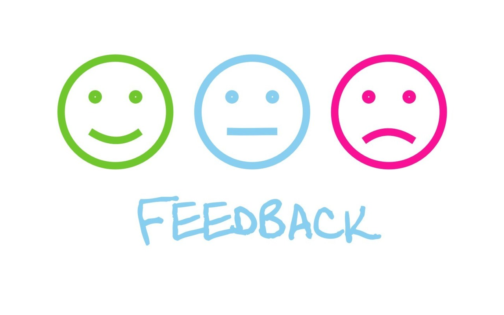

## Feedback Management System

A Simple implementation to provide laravel based feedback system with elegant theme. The project is implemented using Laravel 6.x and provides the following features:

- **[User Authentication Features]()**
- **[Guest Feedback Mechanism]()**
- **[Admin Dashboard to review feedbacks]()**

## Contributing

Thank you for considering contributing to the Project! You can either become a contributor for the project or can simply request the missing features from the contributors.

## License

The Project is open-sourced software licensed
